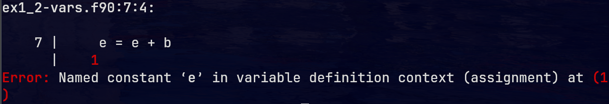
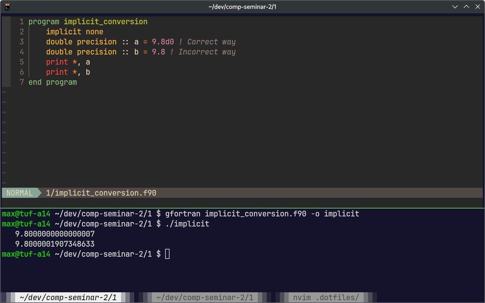
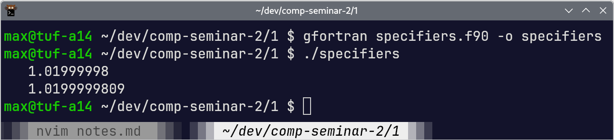

<small>Computer Seminar 2 (Spring 2025)\
Class Notes\
C2TB1702\
Maximilian Fernaldy
</small>

# Class 1

- No distinction between single quotes and double quotes. Both specify string literals.
- No distinction between uppercase and lowercase letters (except in string literals).
- Programs cannot be nested. The following is not valid Fortran:
    ```Fortran
    program hello
        print *, "Hello, world!"
        program hi
            print *, "Hi, world!"
        end program
    end program
    ```
    which is why it is sufficient to type `end program` instead of `end program hello` at the end of every program.
- To define a variable, write the type of the variable, then a double colon (like the scope resolution operator in C++) and the variable name/identifier.
    ```Fortran
    integer :: myInt = 6
    ```
- To define a constant, type `parameter` as an attribute when defining a variable:
    ```Fortran
    real,parameter :: myConstant = 8 !8 or 8.0 is fine
    ```
    changing this value like `myConstant = myConstant + 8` will yield a compilation error like so:
    
- Real literals are in the format `<mantissa>e<exponent>`. For example, ```Fortran
    real :: myNumber1 = 9.8d0 !Equal to 9.8
    real :: myNumber2 = 9.8d1 !Equal to 98
    real :: myNumber3 = 9.8d-1 !Equal to 0.98
    ```
    It is also possible to use a decimal point to indicate a real literal:
    ```Fortran
    real :: myNumber4 = 1.0
    real :: myNumber5 = 1. !No trailing zero is also acceptable, just like C!
    ```
- Same is true for double, just with d instead of e: `<mantissa>d<exponent>`.
    ```Fortran
    double precision :: myDouble = 9.8d0
    ```
    > [!WARNING]
    > **Be careful!** you should always use the above format to define a double precision number. Otherwise, the number you use to define the variable (the literal) will  be a *real literal* instead of a *double literal*. This triggers an *implicit conversion*, which means the compiler will convert the data for you without raising any errors or warnings. Converting a real literal into a double literal means you will lose some precision, defeating the point of using a double precision type in the first place:\
    \
    > 
- It seems Fortran supports function overloading (like C++), or at least a *kind* of it, for the intrinsic functions built into the language. For example, these are the intrinsic functions used to find the largest number in an array:
    ```Fortran
    max0(i0, i1, i2) ! For integer types
    amax1(a0, a1, a2) ! For real types
    dmax1(d0, d1, d2) ! For double types
    max(myNumber0, myNumber1, MyNumber2) ! Automatic
    ```
    `max()` will automatically replace the function call with the correct one depending on the type of array passed into it (similar to how some stdlib functions in C++ may be implemented differently depending on the data type of the parameters passed into the functions). Most likely this is simply implemented by calling the appropriate function according to the type of the parameter.
    ```C
    // C pseudocode
    max(params) {
        type = typeof(params);
        if (type == integer) {
            max0(params);
        }
        else if (type == real):
            amax1(params);
        else if (type == double precision):
            dmax1(params);
        ... // etc.
    }
    ```
- Some notes on print formats:
    - When the asterisk `*` is used as the format specifier with `print`, the compiler will automatically select the number of digits appropriate for the type of the variable that is printed to the stream. For example, when printing a real variable `print *, myReal`, the compiler will print 9 digits of the number.
        ```Fortran
        program example
            implicit none
            real :: myReal = 0.02

            print *, myReal
            stop
        end program
        ```
        When executed, the snippet above will print `1.99999996E-02` to the console. There are 9 digits, from the first `1` to the last `6`. The last three characters `E-02` indicates the exponent of the number. It basically means $\times 10^{-2}$, just like how a non-scientific calculator would sometimes display it.
    - Specific print format specifiers can be used. For example,
    ```Fortran
    print "(f15.10)", myReal
    ```
    will print `myReal` with 10 decimal places. The snippet above will print `0.0199999996` to the console. Of course this is equivalent to the result from the earlier point. However, this is not always true. If we try to print some other real like `1.02e0`, for example, the two formats will yield different results.
    ```
    program specifiers
        implicit none
        real :: myReal2 = 1.02e0

        print *, myReal2
        print "(f15.10)", myReal2 ! Print 15 digits, with 10 of them behind the decimal point
        stop
    end program
    ```
    When executed, the program above will yield the following results:
    
    
